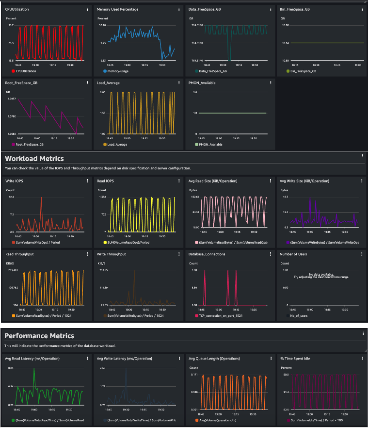

# Monitoring Solution using Amazon CloudWatch


## Scope ##
This monitoring solution can used for Self-Managed Oracle installation on EC2 and RDS Custom for Oracle environment. In both the cases, you have access to the underlying instances/servers.

Monitoring is an important part of maintaining the reliability, availability, and performance of any infrastructure environment. This solution can be extended to monitor self-managed Oracle installations on Amazon Elastic Compute Cloud (Amazon EC2). This will enable you to monitor the health of Oracle instances (both RDS Custom and Self-Managed) and observe changes to the infrastructure and databases workloads. You can monitor metrics over a specific time period and set CloudWatch alarms to receive notifications.

In this post, we will integrate this tool with RDS Custom for Oracle environment. 

:warning: Although this is a non invasive script , make sure you test and run in Dev before you run the scrip in Prod 

## Metrics collected by this method ##

**1. Infrastructure** - CPUUtilization, FreeableMemory, FreeStorageSpace , Load Average

| **Console Name**       | **Description**                                                                     | **Units** |
|------------------------|-------------------------------------------------------------------------------------|-----------|
| **Data_FreeSpace_GB**  | The amount of available storage space in the Data Volume.                           | GB        |
| **Bin_FreeSpace_GB**   | The amount of available storage space in the Binary Volume (Oracle_Home)            | GB        |
| **Root_FreeSpace_GB**  | The amount of available storage space in the Root Volume                            | GB        |
| **CPUUtilization**     | The percentage of CPU utilization.                                                  | Percent   |
| **FreeableMemory**     | The amount of available random access memory.                                       | GB        |
| **Database_available** | PMON Process checker. It will return 1 if the process in available and 0 otherwise. |           |
| **Load_Average**       | Publish the server Load Average                                                     |


 **2. Workload** - ReadIOPS, WriteIOPS, ReadThroughput, WriteThroughput and DatabaseConnections

| **Console Name**         | **Description**                                                                             | **Units**    |
|--------------------------|---------------------------------------------------------------------------------------------|--------------|
| **Read IOPS**            | The average number of disk read I/O operations per second.                                  | Count/Second |
| **Write IOPS**           | The average number of disk write I/O operations per second.                                 | Count/Second |
| **Write Throughput**     | The average number of bytes written to disk per second.                                     | MB/Second    |
| **Read Throughput**      | The average number of bytes read from disk per second.                                      | MB/Second    |
| **Database_Connections** | The number of client network connections to the database instance via Oracle listener port. | Count        |


**3. Performance** - ReadLatency, WriteLatency, DiskQueueDepth

This will indicate the performance metrics of the database workload and you’ll can make more informed decisions about performance of your RDS Custom environment. 

| **Console Name**      | **Description**                                                                  | **Units**    |
|-----------------------|----------------------------------------------------------------------------------|--------------|
| **Avg Read Latency**  | The average amount of time taken per disk Read I/O operation.                    | Milliseconds |
| **Avg Write Latency** | The average amount of time taken per disk Write I/O operation.                   | Milliseconds |
| **Avg Queue Length**  | The number of outstanding I/Os (read/write requests) waiting to access the disk. | Count        |

The solution will fetch data from the AWS/EBS, AWS/EC2 and CWAgentCustom namespace in CloudWatch for the Infrastructure and performance related information. This data will be transformed into Graphs in the Amazon EC2 console (https://docs.aws.amazon.com/AWSEC2/latest/UserGuide/using_cloudwatch_ebs.html#graphs-in-the-aws-management-console-2) by using mathematical expressions and publishing those into AWS CloudWatch. The data related to Database Connections and Memory will be collected via a shell script installed in the host and it will be pushed into custom namespace. These data will be populated in the Custom CloudWatch Dashboard for visualization. Additionally, we will demonstrate AWS CloudWatch Alarms creation on few metrics widgets to receive alerts over email. 


## Pre - Requisites ##
Familiarity with the following AWS services:

    * Amazon RDS Custom for Oracle
    * Amazon CloudWatch
    * Amazon EC2
    * AWS Command Line Interface

Required Permissions :

To access CloudWatch dashboards, you need one of the following IAM permissions :
The *AdministratorAccess* policy
The *CloudWatchFullAccess* policy

Due to security reason, you can follow the principle of least privilege and add custom policy that includes one or more of these specific permissions:
*cloudwatch:GetDashboard* and *cloudwatch:ListDashboards* ** to view dashboards
*cloudwatch:PutDashboard* to create or modify dashboards
*cloudwatch:DeleteDashboards* to delete dashboards


## Installation Process ##

1. Identify the EC2 Instance ID from the AWS Console
2. Identify the EBS Volumes <rdsdbdata> attached to the instance using 

Check for /rdsdbdata as it is the mount point for the data volumes for the custom environment. Use below command to get the volumeIds:

lsblk -o +SERIAL

3. Download and install the custom monitoring scripts

Download the 3 Scripts from this URL in a directory.  For example, I created a directory called “automate” under /home/ec2-user and placed all the 3 files.

``` bash
 pwd
home/ec2-user/automate
$ ls -ltrh
-rwxrwxr-x 1 ec2-user ec2-user 3.2K Oct 12 06:47 custommetrics.sh
-rw-rw-r— 1 ec2-user ec2-user 23K Oct 16 06:29 dash.json
-rwxrwxr-x 1 ec2-user ec2-user 1.7K Oct 16 06:39 installer.sh
$
```

* custommetrics.sh : This script collects memory, TCP connections at port 1521 (Oracle listener port), to publish in the custom CloudWatch namespace. 

* dash.json : This is the dashboard configuration file. It fetches raw data from the AWS/EC2 , AWS/EBS, and Custom namespaces and performs mathematical calculations to display CloudWatch metrics on the dashboard.

* installer.sh : This script will automate the installation process. WE WILL WORK WITH THIS SCRIPT ONLY.

Make the below script executable. 

``` bash
chmod +x installer.sh
```

Run this Script and it will ask for the 4 Volume ID attached to the RDS instance, the EC2 instance ID, the preferred name of the dashboard and the preferred name of the CloudWatch Namespace to hold the Data from EC2 instance.  
This script will perform the following:

* Update the EC2 instance ID in the custommetric.sh and dash.json
* Update the EC2 instance ID and volume ID in the respective files. 
* Install the custommetric.sh in Crontab 
* Install the dashboard in CloudWatch 

. installer.sh

``` bash
. installer.sh 
Enter First Volume ID (Format vol-xxxxxx)
vol-12345a
Enter Second Volume ID (Format vol-xxxxxx)
vol-67890b
Enter Third Volume ID (Format vol-xxxxxx)
vol-12345c
Enter Fourth Volume ID (Format vol-xxxxxx)
vol-67890d
Enter EC2 Instance ID (Format i-xxxxxx)
i-abcde
Enter the Name of CloudWatch Dashboard (Example - <RDS_Name>_Dashboard)
custom19_dashboard
Enter the Name of Custom Namespace for propagating Host Level metrics (Example - <RDS_Name>_Agent)
custom19c_namespace
These are the following Volume ID and the EC2 instance ID
vol-12345a
vol-67890b
vol-12345c
vol-67890d
i-abcde
Preparing the shell Script custommetric.sh
Installing the Script in Crontab
rdsdb     1750     1  0 Oct08 ?        00:01:02 ora_pmon_ORCL
Custom Metric Shell Script is ready and installed in crontab at 60 seconds frequency.
Preparing the dashboard.json file
The Script is ready
Installing the Script in Amazon CloudWatch
{
    "DashboardValidationMessages": []
}
Installation Successful. Please login to AWS Console and check the dashboard. The metrics might take few minutes to populate in CloudWatch
$ 
```

The final graphs will look like as below:




## (Optional) Manual modification of the scripts 

There are situations when you might need to manually update and run the scripts.

  

### Scenario 1 – Replacement of EC2 Instance

  

The underlying EC2 instance catered to RDS Custom for Oracle or Self-managed Oracle on EC2 will get changed if the instance is modified to move to a higher or lower instance class. The AWS automation component can also replace unhealthy underlying EC2 instance as a part of recovery action or maintenance.

In both the cases, the instance ID of the underlying EC2 instance will change.

  

In this situation, you can check the new EC2 instance ID from the AWS Console. You need to update the EC2 instance ID in the following scripts and run it.

  

Shell Script

  

```

sed -i "s/<Old EC2 Instance ID>/<new EC2 Instance ID>/g" custommetrics.sh

Example –

sed -i "s/i-0ea2648c36a7c0574/i-6a7c0574/g" custommetrics.sh

  

```

  

You don’t need to reschedule this in crontab as it is already installed.

  

Dashboard file

```

sed -i "s/<Old EC2 Instance ID>/<new EC2 Instance ID>/g" dash.json

--Example-–

sed -i "s/i-0ea2648c36a7c0574/i-6a7c0574/g" dash.json

  

```

  

Update the existing dashboard using modified dash.json file either from AWS Console or using AWS CLI.

```

aws cloudwatch put-dashboard --dashboard-name <Existing Dashboard Name> --dashboard-body file://dash.json --region us-east-1

  
  

- You get the following output if your API call successfully passed and created the dashboard --

{

  

"DashboardValidationMessages": []

}

  

```


### Scenario 2 – Replacement of EBS Volumes

  
The volumes allocated to the EC2 instance may get replaced due to underlying hardware failure. In this situation, AWS automation will replace the impaired volume with a new one. This will cause the change in the volume ID.

In such cases, you  need to  update the dashboard to fetch data from the updated volume ID.

You  can  update the new volume ID in the dashboard configuration file and update the dashboard using AWS Console or AWS CLI.  
```
sed -i "s/<Old Volume>/<New Volume>/g" dash.json
```

--Install the Dashboard—
```
aws cloudwatch put-dashboard --dashboard-name <Existing Dashboard Name> --dashboard-body file://dash.json --region us-east-1
 ```
 
-- You get the following output if your API call successfully passed and update the dashboard --
 ```
{

 "DashboardValidationMessages": []
 }
```
### Scenario 3 – Addition of EBS Volumes

For this current use case using RDS Custom for Oracle, we have four EBS volumes. In case, you have  more  than 4 data volume and you  want to  monitor the same, but you  can  modify this per your use case in the JSON file and add volumes similarly. You  can  use any JSON editor to validate the format after the editing completes.

For example, if you have five volumes, then you  need to  add the fifth volume and replace the other volumes IDs for each widget. The following is an example of one widget with five volumes:  
```
{

            "height": 6,

            "width": 6,

            "y": 6,

            "x": 0,

            "type": "metric",

            "properties": {

                "metrics": [

                    [ "AWS/EBS", "VolumeReadOps", "VolumeId", "vol-027a6e961a7dc7acc", { "id": "m1", "visible": false } ],

                    [ "...", "vol-058b4cd3d5db1976a", { "id": "m2", "visible": false } ],

                    [ "...", "vol-087b136001ed84be9", { "id": "m3", "visible": false } ],

                    [ "...", "vol-04f392aa5130cede1", { "id": "m4", "visible": false } ],

                   ## Adding the fifth volume below and modifying the math expression with Fifth volumeID.

                    [ "...", "vol-058b4cd3d5db15765", { "id": "m5", "visible": false } ],

                    [ { "expression": "SUM([m1,m2,m3,m4,m5])/60", "label": "SUM(VolumeReadOps)/Period", "id": "e1" } ]

                ],

                "view": "timeSeries",

                "stacked": false,

                "region": "eu-west-1",

                "stat": "Sum",

                "period": 60,

                "title": "Read Throughput (IOPS)"

            }

        }     

  ``` 
You add the newly added volumeID in the math expression to calculate the aggregated values.


## Security

See [CONTRIBUTING](CONTRIBUTING.md#security-issue-notifications) for more information.

## License

This library is licensed under the MIT-0 License. See the LICENSE file.

